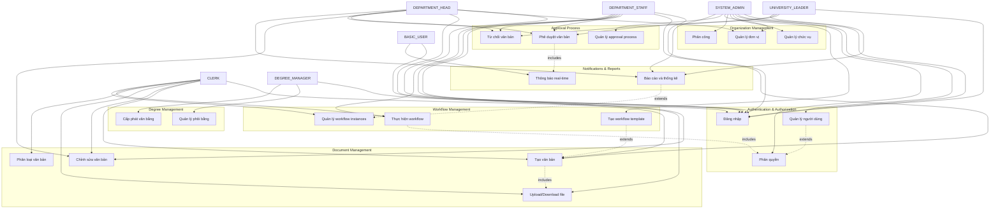

# Biểu đồ Use Case - Hệ thống TDMU Dispatch

## Tổng quan

Hệ thống TDMU Dispatch là một hệ thống quản lý công văn điện tử tích hợp chữ ký số và xử lý thời gian thực cho Trường Đại học Thủ Dầu Một. Hệ thống hỗ trợ quản lý toàn bộ vòng đời công văn từ soạn thảo, gửi, phê duyệt, lưu trữ và truy xuất.

## Các Actor (Tác nhân)

### 1. **SYSTEM_ADMIN** (Quản trị viên hệ thống)
- **Mô tả**: Người có toàn quyền trên hệ thống
- **Chức năng**: Quản lý người dùng, phân quyền, cấu hình hệ thống

### 2. **UNIVERSITY_LEADER** (Lãnh đạo cấp cao)
- **Mô tả**: Hiệu trưởng, Phó Hiệu trưởng
- **Chức năng**: Phê duyệt văn bản quan trọng, xem báo cáo toàn trường

### 3. **DEPARTMENT_HEAD** (Trưởng đơn vị)
- **Mô tả**: Trưởng khoa, Trưởng phòng
- **Chức năng**: Quản lý đơn vị, phê duyệt văn bản trong phạm vi đơn vị

### 4. **DEPARTMENT_STAFF** (Chuyên viên/Nhân viên)
- **Mô tả**: Chuyên viên các phòng ban
- **Chức năng**: Soạn thảo văn bản, thực hiện nghiệp vụ chuyên môn

### 5. **CLERK** (Văn thư)
- **Mô tả**: Văn thư, thư ký
- **Chức năng**: Xử lý luồng văn bản, nhận văn bản đến, phát hành văn bản đi

### 6. **DEGREE_MANAGER** (Quản lý văn bằng)
- **Mô tả**: Chuyên viên phòng Đào tạo, Công tác Sinh viên
- **Chức năng**: Quản lý văn bằng, chứng chỉ

### 7. **BASIC_USER** (Người dùng cơ bản)
- **Mô tả**: Tất cả người dùng đã xác thực
- **Chức năng**: Xem thông tin cá nhân, thông báo chung

## Các Use Case chính

### 1. **Quản lý Xác thực và Phân quyền**

#### 1.1 Đăng nhập hệ thống
- **Actor**: Tất cả users
- **Mô tả**: Đăng nhập vào hệ thống bằng email/password hoặc OTP
- **Use Cases**:
  - Đăng nhập bằng mật khẩu
  - Đăng nhập bằng OTP
  - Gửi mã OTP
  - Đặt lại mật khẩu
  - Đăng xuất

#### 1.2 Quản lý người dùng (SYSTEM_ADMIN)
- **Actor**: SYSTEM_ADMIN
- **Use Cases**:
  - Tạo tài khoản người dùng
  - Cập nhật thông tin người dùng
  - Phân quyền cho người dùng
  - Vô hiệu hóa/kích hoạt tài khoản
  - Xem danh sách người dùng

### 2. **Quản lý Tổ chức**

#### 2.1 Quản lý đơn vị (SYSTEM_ADMIN, DEPARTMENT_HEAD)
- **Actor**: SYSTEM_ADMIN, DEPARTMENT_HEAD
- **Use Cases**:
  - Tạo đơn vị mới
  - Cập nhật thông tin đơn vị
  - Xóa đơn vị
  - Xem cấu trúc tổ chức
  - Quản lý chức vụ trong đơn vị

#### 2.2 Quản lý chức vụ (SYSTEM_ADMIN)
- **Actor**: SYSTEM_ADMIN
- **Use Cases**:
  - Tạo chức vụ mới
  - Cập nhật chức vụ
  - Xóa chức vụ
  - Phân công chức vụ cho người dùng

### 3. **Quản lý Văn bản**

#### 3.1 Tạo và quản lý văn bản
- **Actor**: DEPARTMENT_STAFF, CLERK, SYSTEM_ADMIN
- **Use Cases**:
  - Tạo văn bản mới
  - Chỉnh sửa văn bản
  - Xóa văn bản
  - Upload file đính kèm
  - Download file đính kèm
  - Xem danh sách văn bản
  - Tìm kiếm văn bản
  - Lọc văn bản theo loại

#### 3.2 Phân loại văn bản
- **Actor**: CLERK, SYSTEM_ADMIN
- **Use Cases**:
  - Tạo loại văn bản mới
  - Cập nhật loại văn bản
  - Xóa loại văn bản
  - Tạo nhóm văn bản mới
  - Cập nhật nhóm văn bản

### 4. **Quản lý Workflow (Quy trình)**

#### 4.1 Tạo và quản lý workflow template
- **Actor**: SYSTEM_ADMIN
- **Use Cases**:
  - Tạo workflow template mới
  - Cập nhật workflow template
  - Xóa workflow template
  - Thiết lập các bước trong workflow
  - Phân quyền cho từng bước

#### 4.2 Thực hiện workflow
- **Actor**: Tất cả users (theo role)
- **Use Cases**:
  - Tạo workflow instance
  - Thực hiện action (APPROVE, REJECT, TRANSFER, CANCEL, COMPLETE)
  - Xem trạng thái workflow
  - Xem lịch sử workflow
  - Nhận thông báo workflow

#### 4.3 Quản lý workflow instances
- **Actor**: Tất cả users (theo role)
- **Use Cases**:
  - Xem danh sách workflow đang chờ xử lý
  - Xem chi tiết workflow
  - Tìm kiếm workflow
  - Lọc workflow theo trạng thái

### 5. **Quản lý Phê duyệt**

#### 5.1 Quy trình phê duyệt
- **Actor**: UNIVERSITY_LEADER, DEPARTMENT_HEAD, DEPARTMENT_STAFF
- **Use Cases**:
  - Phê duyệt văn bản
  - Từ chối văn bản
  - Yêu cầu chỉnh sửa
  - Xem lịch sử phê duyệt
  - Tạo báo cáo phê duyệt

#### 5.2 Quản lý approval process
- **Actor**: SYSTEM_ADMIN
- **Use Cases**:
  - Tạo quy trình phê duyệt
  - Cập nhật quy trình phê duyệt
  - Thiết lập người phê duyệt
  - Xem thống kê phê duyệt

### 6. **Quản lý File và Tài liệu**

#### 6.1 Upload và Download
- **Actor**: Tất cả users
- **Use Cases**:
  - Upload file lên Google Drive
  - Download file từ Google Drive
  - Xem thông tin file
  - Chia sẻ file

#### 6.2 Quản lý tài liệu
- **Actor**: CLERK, SYSTEM_ADMIN
- **Use Cases**:
  - Tạo tài liệu mới
  - Cập nhật tài liệu
  - Xóa tài liệu
  - Phân loại tài liệu

### 7. **Thông báo và Báo cáo**

#### 7.1 Hệ thống thông báo
- **Actor**: Tất cả users
- **Use Cases**:
  - Nhận thông báo real-time
  - Xem danh sách thông báo
  - Đánh dấu đã đọc
  - Cấu hình thông báo

#### 7.2 Báo cáo và thống kê
- **Actor**: UNIVERSITY_LEADER, DEPARTMENT_HEAD, SYSTEM_ADMIN
- **Use Cases**:
  - Xem báo cáo tổng quan
  - Tạo báo cáo tùy chỉnh
  - Xuất báo cáo
  - Xem thống kê workflow

### 8. **Quản lý Văn bằng (DEGREE_MANAGER)**

#### 8.1 Quản lý phôi bằng
- **Actor**: DEGREE_MANAGER
- **Use Cases**:
  - Tạo phôi bằng mới
  - Cập nhật phôi bằng
  - In phôi bằng
  - Cấp phát văn bằng
  - Xác minh văn bằng

## Mối quan hệ giữa các Use Case

### Include Relationships
- **Đăng nhập** includes **Xác thực người dùng**
- **Tạo văn bản** includes **Upload file**
- **Thực hiện workflow** includes **Kiểm tra quyền**
- **Phê duyệt văn bản** includes **Gửi thông báo**

### Extend Relationships
- **Quản lý người dùng** extends **Quản lý phân quyền**
- **Workflow** extends **Quản lý văn bản**
- **Báo cáo** extends **Thống kê hệ thống**

## Ràng buộc và Điều kiện

### Preconditions
- User phải đăng nhập để thực hiện các use case
- User phải có quyền phù hợp để thực hiện action
- Workflow phải được thiết lập trước khi thực hiện

### Postconditions
- Sau khi tạo văn bản, workflow sẽ được khởi tạo
- Sau khi phê duyệt, thông báo sẽ được gửi
- Sau khi hoàn thành workflow, văn bản sẽ được lưu trữ

## Biểu đồ Use Case (Mermaid)

## Kết luận

Biểu đồ use case này mô tả đầy đủ các chức năng của hệ thống TDMU Dispatch, từ quản lý xác thực, quản lý tổ chức, quản lý văn bản, workflow, phê duyệt đến thông báo và báo cáo. Hệ thống được thiết kế theo mô hình role-based access control, đảm bảo mỗi người dùng chỉ có thể thực hiện các chức năng phù hợp với vai trò của mình.
